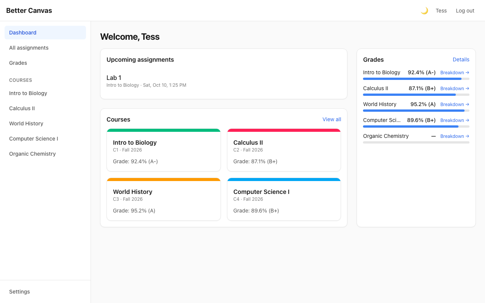
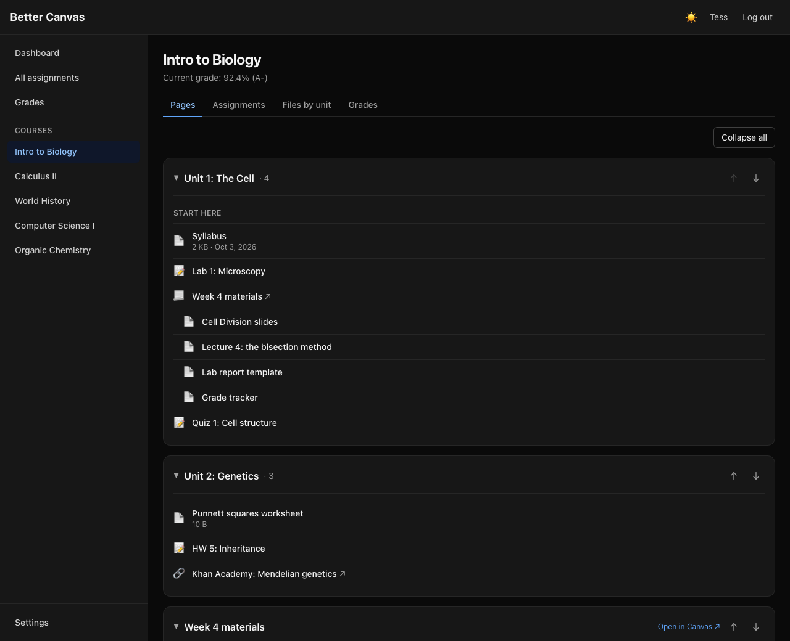
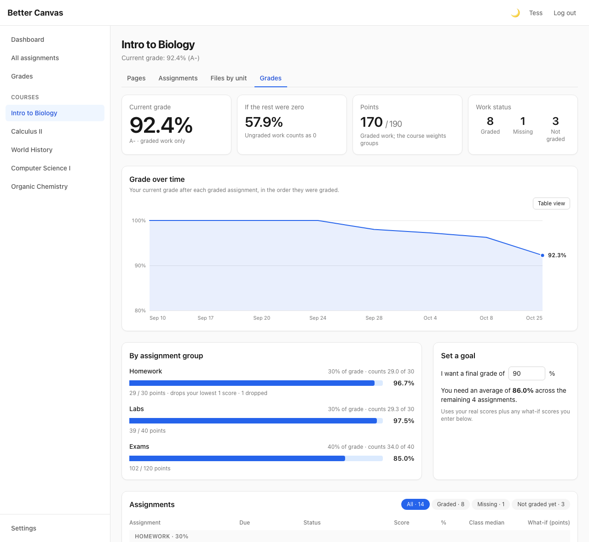
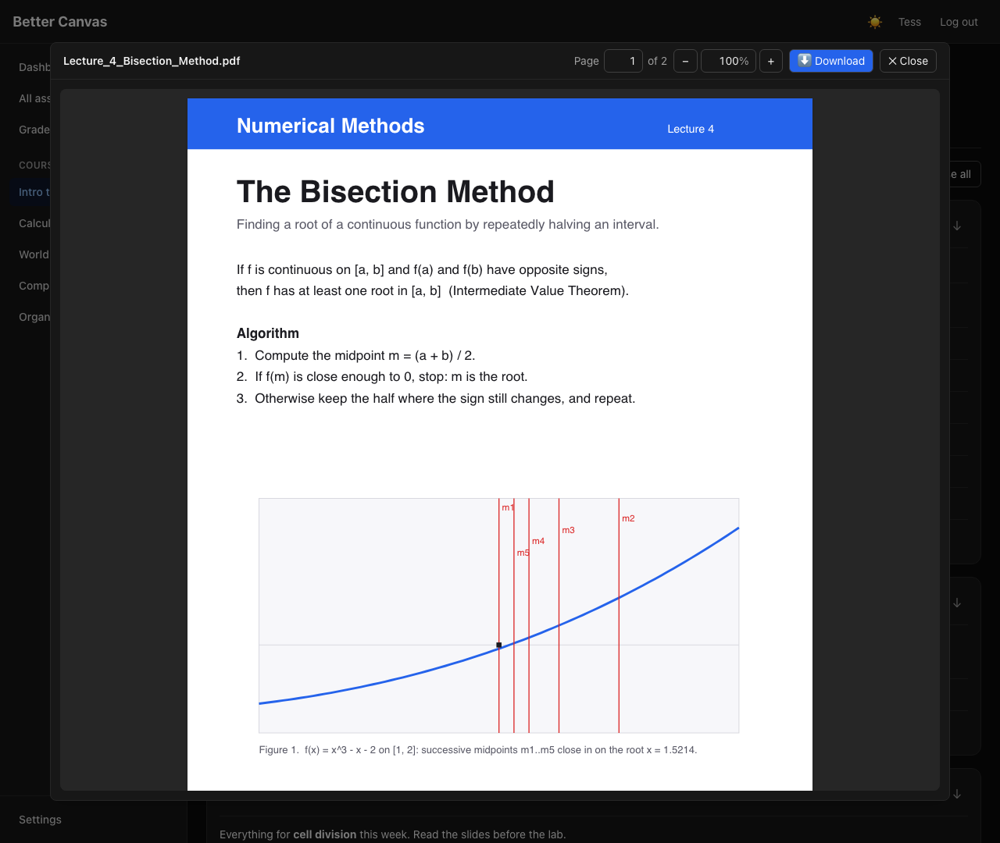
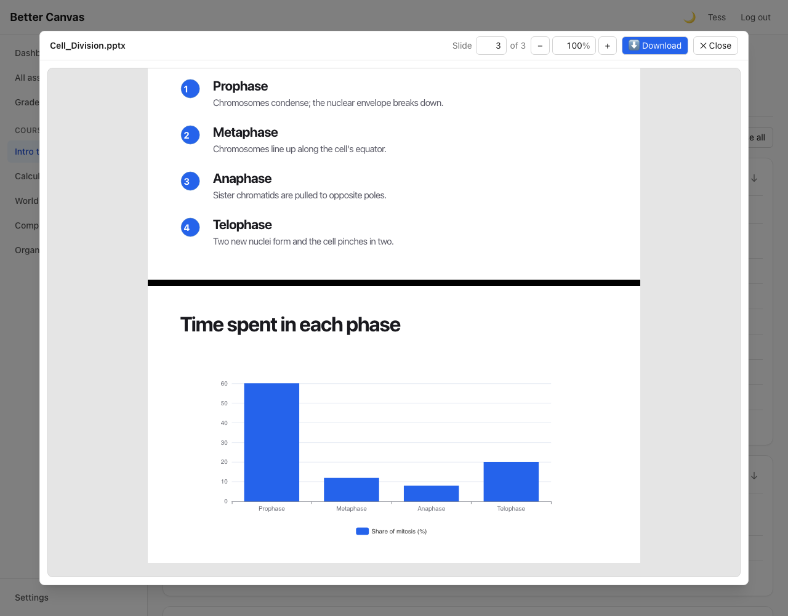

# Courseline

A faster, cleaner web client for [Canvas LMS](https://www.instructure.com/canvas). It runs entirely in your browser and
talks directly to your school's Canvas API with a personal access token. There is no server of its own.

React · TypeScript · Vite · Tailwind CSS 4



## What it does

- **Course pages and modules in one list.** Collapsible, reorderable, remembered per course, so a course looks the same
  whether the teacher built it from Pages or from Modules.
- **In-app file viewer.** PDF, Word, Excel, PowerPoint, images and code open in a viewer with page numbers, typed zoom
  and an explicit Download button. Nothing downloads unless you press that button.
- **In-depth grades page.** Grade over time, assignment-group breakdown with weights and drop rules, what-if scores
  and a "what do I need to reach X%" calculator.
- **Dark mode and a custom accent color**, plus a setting to pick which courses to show.

## Screenshots

Screenshots use made-up course data.

| Course pages and modules in one view | Grades: trend, groups, what-if |
|---|---|
|  |  |
| **PDF viewer** | **PowerPoint viewer** |
|  |  |

Developer documentation (architecture, every file, how to change anything, known gaps):
**[DEVELOPER_GUIDE.md](DEVELOPER_GUIDE.md)**.

## Run it

Requires **Node 22.13 or newer** (22 LTS recommended). Node 20 can run the app with an `EBADENGINE` warning (the PDF
library declares `>=22.13`), but cannot run the tests (Vitest 5 needs 22.12+).

```bash
npm install
cp .env.example .env      # then edit it (see below)
npm run dev               # prints the address, usually http://localhost:5173
```

If port 5173 is busy, Vite moves to the next one and prints it. Use the address it prints.

Needs a current browser (Chrome/Edge 111+, Safari 16.4+, Firefox 128+; Word/PowerPoint zoom needs Firefox 126+),
because Tailwind 4 uses modern CSS.

| Command | What it does |
|---|---|
| `npm run dev` | Dev server |
| `npm test` | Unit and component tests (Vitest) |
| `npm run typecheck` | TypeScript check (strict) |
| `npm run build` | Typecheck, then a production bundle in `dist/` |

### Environment (`.env`)

| Variable | Meaning |
|---|---|
| `VITE_CANVAS_BASE_URL` | Your school's Canvas address, e.g. `https://myschool.instructure.com`. Pre-fills the login form and is the dev proxy's target. |
| `VITE_CANVAS_API_TOKEN` | Optional. Skips the login screen. Leave it empty unless you understand the security note below. |
| `VITE_USE_DEV_PROXY` | `true` sends all Canvas calls through the Vite dev server. Needed if your school blocks browser requests (CORS), and **required for file previews at schools that do**. Restart `npm run dev` after changing it. |

### Get a Canvas API token

1. Log in to your school's Canvas in a browser.
2. **Account** (left rail) → **Settings**.
3. Scroll to **Approved Integrations** → **+ New Access Token**.
4. Give it a purpose ("Courseline") and an expiry date (set one), then **Generate Token**.
5. **Copy it immediately.** Canvas never shows it again.

Paste it into the app's login screen together with your school's address (what you see in the address bar when logged
in to Canvas).

> Some schools disable personal access tokens. If "+ New Access Token" is missing, ask your Canvas admin.

## Security

- The token is stored in the browser's **localStorage**. Any script on the page (an XSS bug, a compromised npm package)
  can read it, and the token has **your full Canvas access**.
- `VITE_*` variables are **inlined into the built JavaScript**. Never build and publish with a real token in `.env`.
- This is meant for personal use on your own computer. Before anyone else uses it, move the token behind a small
  backend or use Canvas OAuth2 (needs a developer key from your Canvas admin).
- Each person uses their **own** token. Revoke tokens you no longer need (Settings → Approved Integrations).
- Never commit `.env`. It is in `.gitignore`.

## Status

In day-to-day use by the author on real school courses. Covered by automated tests: the API client (pagination, error
mapping, downloads, file upload), grade calculation, HTML sanitizing, the data cache, accent colors, the submission
form, and a smoke test that renders every screen against a fake Canvas. The screens and the file viewer were also checked in a real browser, in light and dark mode and at phone width.

Canvas installations differ a little between schools. If you use this at a new school, try a submission on a throwaway
assignment first. If your school's file storage refuses browser uploads, the app says so and points you to "Submit in
Canvas". See [DEVELOPER_GUIDE.md § Known gaps](DEVELOPER_GUIDE.md#13-known-gaps-and-ideas).

## Canvas API notes

| Topic | What to know |
|---|---|
| Auth | `Authorization: Bearer <token>` header on every request. |
| Base path | `https://<school>/api/v1/...` |
| Pagination | Defaults to **10 items/page**. Pass `per_page=100` (the max). The next page URL is in the **`Link` response header** (`rel="next"`) and is opaque: follow it verbatim. `getAll()` in `src/api/client.ts` does this. |
| Array params | Need brackets: `include[]=submission&include[]=total_scores`. |
| Rate limits | Leaky bucket (~700 units, refills continuously). Remaining quota is in `X-Rate-Limit-Remaining`. Exceeding it returns **403** (not 429) with "Rate Limit Exceeded" in the body. Avoid one request per course; prefer aggregate endpoints. |
| Grades | `include[]=total_scores` on `/courses` returns `computed_current_score` / `computed_current_grade` on the enrollment. `null` means hidden or ungraded, not 0. |
| Restricted courses | Past/future-term courses can come back with no `name` and `access_restricted_by_date: true`. They are filtered out. |
| Dates | ISO 8601 UTC strings. `due_at` can be `null`. Per-student overrides aren't reflected in the base `due_at`. |
| IDs | Numbers, but may exceed 2^53 on some shards. Send `Accept: application/json+canvas-string-ids` if that bites. |
| CORS | Canvas generally allows browser calls with a Bearer token, but some institutions block it. If you see a network/CORS error, set `VITE_USE_DEV_PROXY=true` and restart `npm run dev`. |

Official docs: <https://canvas.instructure.com/doc/api/>. More quirks, and why the code handles them the way it does, are
in [DEVELOPER_GUIDE.md § Canvas quirks](DEVELOPER_GUIDE.md#8-canvas-quirks-reference).

## License

[PolyForm Noncommercial 1.0.0](LICENSE). In plain words:

- **You can** use it, change it and share it (with the license attached) for **personal and other noncommercial use**:
  your own coursework, hobby projects, learning, and use by schools and non-profits.
- **You cannot** sell it, sell a changed version of it, or use it to make money.
- **Commercial use is reserved to the copyright holder.** To license it commercially, contact the author.

This is a "source-available" license, not an OSI-approved open-source license. The code is public, but it is not
free for commercial use.

## Contributing

```bash
npm run typecheck && npm test && npm run build
```

All three must pass (CI runs them on every push and pull request). Read
[DEVELOPER_GUIDE.md § Conventions](DEVELOPER_GUIDE.md#12-conventions) first.
